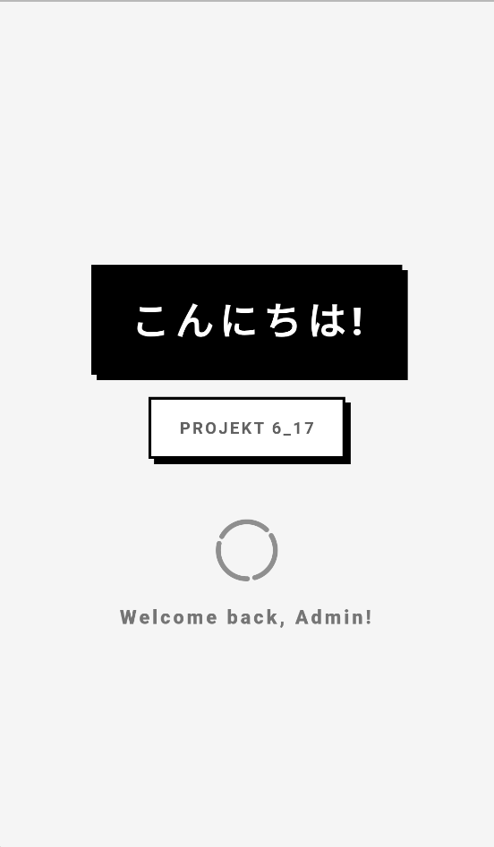
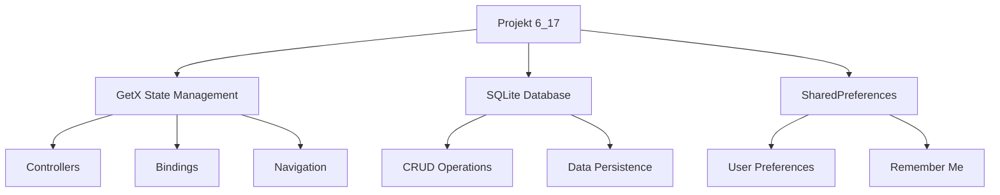

# 📝 Flutter Todo List App - Projekt 6_17

<div> 


**Aplikasi Todo List dengan desain Neo-Brutalist yang powerful dan modern**

</div>



---

## 📖 Tentang Proyek

Aplikasi Todo List modern dengan desain **Neo-Brutalist** yang dibangun menggunakan Flutter dan GetX state management. Menampilkan interface yang bold, kontras tinggi, dan fungsional dengan persistent storage menggunakan SQLite database.

**🎯 Tujuan:** Menciptakan aplikasi manajemen tugas yang efisien dengan desain unik dan user experience yang intuitif.

---

## ✨ Fitur Utama

### 🔐 Autentikasi
- Login & Register dengan validasi form
- Remember Me menggunakan SharedPreferences
- Auto-login pada splash screen
- Session management dengan GetX
- Default admin account (Username: `Admin`, Password: `12345`)

### 📋 Manajemen Todo
- ✅ CRUD operations lengkap (Create, Read, Update, Delete)
- 🏷️ **Kategori:** Work, Personal, Study
- ⚡ **Prioritas:** Low, Normal, High, Urgent dengan color-coding
- ✔️ **Swipe to complete** - Geser kanan untuk menyelesaikan
- 🔄 **Restore todos** - Geser kiri untuk mengembalikan dari history
- 💾 **Persistent storage** dengan SQLite database

### 🎨 Interface & UX
- 📱 **Responsive Design** - Adaptif untuk mobile dan tablet/desktop
- 🖥️ **Dual Layout System:**
  - Mobile Layout (< 600px)
  - Wide-screen Layout (≥ 600px) dengan grid view
- 🚀 Splash Screen dengan loading animation
- 📱 Bottom Navigation dengan 2 tab (Active & History)
- 🗂️ Pemisahan Active Todos dan Completed History
- 🍔 Drawer navigation dengan profil anggota tim
- 🔔 Snackbar notifications untuk user feedback
- 💬 Confirmation dialogs untuk aksi kritis

### 💾 Database & Storage
- **SQLite (sqflite)** - Database lokal untuk persistent storage
- **SharedPreferences** - Menyimpan credentials dan preferensi user
- **CRUD Operations** - Implementasi lengkap Create, Read, Update, Delete
- **Auto-load data** - Data otomatis dimuat saat aplikasi dibuka
- **Data persistence** - Data tetap tersimpan setelah aplikasi ditutup

---

## 🎨 Desain Neo-Brutalist

Filosofi desain yang diterapkan:

| Elemen | Karakteristik |
|--------|---------------|
| **Typography** | Bold, tebal, kontras tinggi |
| **Borders** | 3-4px thickness, sharp corners (no radius) |
| **Colors** | High contrast black-white dengan accent colors |
| **Shadows** | Drop shadow hitam dengan offset untuk dimensi |
| **Layout** | Minimalis namun impactful, fokus pada fungsi |

---

## 🗄️ Database Structure

### Tabel: `todos`

| Column | Type | Constraint | Description |
|--------|------|-----------|-------------|
| `id` | TEXT | PRIMARY KEY | UUID unik untuk setiap todo |
| `judul` | TEXT | NOT NULL | Judul/nama todo |
| `deskripsi` | TEXT | | Deskripsi detail todo |
| `kategori` | TEXT | NOT NULL | work / personal / study |
| `tingkatKepentingan` | TEXT | NOT NULL | low / normal / high / urgent |
| `selesai` | INTEGER | DEFAULT 0 | 0 = active, 1 = completed |

### 🔑 Primary Key: UUID

**Mengapa UUID?**
- ✅ Globally unique identifier
- ✅ Tidak perlu auto-increment coordination
- ✅ Format 36 karakter: `550e8400-e29b-41d4-a716-446655440000`
- ✅ Mudah dibaca dan di-debug

**Penggunaan Primary Key:**
```dart
// Create
final newTodo = Todo(id: _uuid.v4(), ...);

// Read
getTodoById(String id)

// Update
updateTodo(where: 'id = ?', whereArgs: [id])

// Delete
deleteTodo(where: 'id = ?', whereArgs: [id])
```

---

## 🔄 CRUD Operations

| Operation | Method | SQL | Fungsi |
|-----------|--------|-----|--------|
| **Create** | `addTodo()` | `INSERT INTO` | Tambah todo baru ke database |
| **Read** | `loadTodos()`, `getTodoById()` | `SELECT FROM` | Tampilkan/ambil data dari database |
| **Update** | `updateTodo()`, `toggleComplete()` | `UPDATE SET` | Edit todo & ubah status |
| **Delete** | `deleteTodo()` | `DELETE FROM` | Hapus todo dari database |

### Contoh Implementasi

#### CREATE - Tambah Todo
```dart
Future<void> addTodo({
  required String judul,
  required String deskripsi,
  required String kategori,
  required String tingkatKepentingan,
}) async {
  final newTodo = Todo(
    id: _uuid.v4(),
    judul: judul,
    deskripsi: deskripsi,
    kategori: kategori,
    tingkatKepentingan: tingkatKepentingan,
  );
  
  await _dbHelper.insertTodo(newTodo);
  todos.add(newTodo);
}
```

#### READ - Ambil Data
```dart
// Get semua todos
Future<void> loadTodos() async {
  final todosFromDb = await _dbHelper.getAllTodos();
  todos.value = todosFromDb;
}

// Get by ID
Future<Todo?> getTodoById(String id) async {
  final result = await db.query('todos', where: 'id = ?', whereArgs: [id]);
  return result.isNotEmpty ? Todo.fromMap(result.first) : null;
}
```

#### UPDATE - Edit Data
```dart
// Update seluruh todo
Future<void> updateTodo({
  required String id,
  required String judul,
  required String deskripsi,
  required String kategori,
  required String tingkatKepentingan,
}) async {
  final updatedTodo = Todo(...);
  await _dbHelper.updateTodo(updatedTodo);
  todos.refresh();
}

// Toggle complete status
Future<void> toggleComplete(String id, bool value) async {
  await _dbHelper.toggleComplete(id, value);
  todos.refresh();
}
```

#### DELETE - Hapus Data
```dart
Future<void> deleteTodo(String id) async {
  await _dbHelper.deleteTodo(id);
  todos.removeWhere((todo) => todo.id == id);
}
```

---

## 🏗️ Arsitektur

### State Management dengan GetX
- **Reactive State** - Perubahan otomatis ter-reflect di UI
- **Dependency Injection** - Service locator dengan bindings
- **Navigation** - Routing tanpa BuildContext
- **Controllers** - Business logic terpisah dari UI

### Struktur Proyek
```
lib/
├── Routes/           # Routing configuration & navigation
├── bindings/         # Dependency injection setup
├── controller/       # Business logic & state management
├── database/         # SQLite database helper
├── models/           # Data models (Todo, User, etc)
├── pages/           
│   ├── Mobile/       # Mobile-optimized UI (< 600px)
│   └── Widescreen/   # Tablet/Desktop UI (≥ 600px)
└── widgets/          # Reusable UI components
```

### Komponen Utama

| Komponen | Fungsi |
|----------|--------|
| **AuthController** | Login/logout & SharedPreferences management |
| **TodoController** | CRUD operations & SQLite integration |
| **NavigationController** | Bottom navigation state |
| **SplashController** | Splash screen & auto-login logic |
| **DatabaseHelper** | SQLite database operations wrapper |

---

## 📦 Dependencies

### Core Libraries

| Package | Versi | Fungsi |
|---------|-------|--------|
| **get** | ^4.6.6 | State management, routing, dependency injection |
| **sqflite** | ^2.4.1 | SQLite database lokal |
| **shared_preferences** | ^2.3.3 | Key-value storage untuk settings |
| **uuid** | ^4.5.1 | Generate unique ID |
| **intl** | ^0.19.0 | Format tanggal & angka |
| **path** | ^1.9.0 | Path management untuk database |

### UI & Animation

| Package | Versi | Fungsi |
|---------|-------|--------|
| **animations** | ^2.0.11 | Material transitions |
| **flutter_staggered_animations** | ^1.1.1 | Staggered list animations |
| **loading_animation_widget** | ^1.3.0 | Loading indicators |
| **cupertino_icons** | ^1.0.8 | iOS-style icons |

### Development

| Package | Versi | Fungsi |
|---------|-------|--------|
| **flutter_lints** | ^5.0.0 | Linting rules |
| **flutter_launcher_icons** | ^0.14.2 | App icon generator |

---

## 🚀 Instalasi

### Prerequisites
- Flutter SDK ≥ 3.0.0
- Dart SDK ≥ 3.0.0
- Android Studio / VS Code
- Device atau emulator Android/iOS

### Langkah-langkah

1. **Clone repository**
```bash
git clone https://github.com/Azelzy/PROJEK_KOLLAB_FLUTTER_06_17.git
cd project_17_6
```

2. **Install dependencies**
```bash
flutter pub get
```

3. **Run aplikasi**
```bash
flutter run
```

4. **Build APK (opsional)**
```bash
flutter build apk --release
```

---

## 🎯 Cara Penggunaan

### Login & Authentication
1. Launch aplikasi (splash screen akan muncul)
2. Jika sudah pernah login dengan "Remember Me", akan otomatis login
3. Login dengan akun default:
   - **Username:** `Admin`
   - **Password:** `12345`
4. Atau register akun baru
5. Centang "Remember Me" untuk auto-login di masa depan

### Mengelola Todo
| Aksi | Cara |
|------|------|
| **Tambah** | Tap FAB (+) di halaman Todo List |
| **Edit** | Tap icon edit pada todo card |
| **Complete** | Swipe kanan pada todo item |
| **Restore** | Swipe kiri pada completed todo di History |
| **Delete** | Tap icon delete di History page |

### Navigasi
- **Bottom Navigation:** Switch antara Active Todos dan History
- **Drawer Menu:** Akses profil anggota dan logout
- **Responsive:** Layout otomatis menyesuaikan ukuran layar

---

## 📱 Responsive Design

### Mobile Layout (< 600px)
- Single column list view
- Bottom navigation bar
- Compact card design
- Touch-optimized spacing
- Full-width components

### Wide Layout (≥ 600px)
- Two-column grid layout
- Split screen login page
- Larger interactive elements
- Better space utilization
- Side-by-side components

---

## 👥 Anggota Kelompok

<div align="center">

| Nama | Absen | Role | GitHub |
|:----:|:-----:|:----:|:------:|
| **Azka El Fachrizy** | 06 | UI/UX Designer & Database | [](https://github.com/Azelzy) |
| **Ihsan H.U** | 17 | UI/UX Designer & Controller| [](https://github.com/IhsanHU-coder) |

</div>

---

## 🛠️ Tech Stack Summary



---

## 🤝 Kontribusi

Kami menerima kontribusi! Ikuti langkah berikut:

1. **Fork** repository ini
2. **Create branch** untuk fitur baru
   ```bash
   git checkout -b feature/AmazingFeature
   ```
3. **Commit** perubahan Anda
   ```bash
   git commit -m 'Add some AmazingFeature'
   ```
4. **Push** ke branch
   ```bash
   git push origin feature/AmazingFeature
   ```
5. **Open Pull Request**

### Aturan Kontribusi
- Pastikan code mengikuti Flutter linting rules
- Tambahkan dokumentasi untuk fitur baru
- Test semua fungsi sebelum submit PR
- Gunakan commit message yang deskriptif

---

## 📞 Kontak

<div align="center">

**Ada pertanyaan atau saran?**

[](https://github.com/Azelzy)
[](https://github.com/IhsanHU-coder)

**Project Link:** [PROJEK_KOLLAB_FLUTTER_06_17](https://github.com/Azelzy/PROJEK_KOLLAB_FLUTTER_06_17)

</div>

---

## 📄 License

Project ini dibuat untuk keperluan pembelajaran dan tidak memiliki lisensi komersial.

---

<div align="center">


ありがとう ございます ♡ᰔ૮₍ ˃ ⤙ ˂ ₎ა

⭐ **Star repository ini jika berguna!** ⭐

</div>
